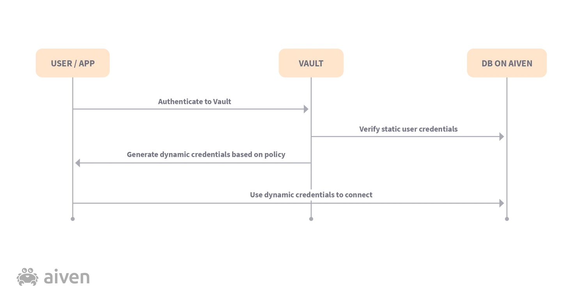

# Managing secrets for your data infrastructure

Who manages the production database passwords in your organization? Is there ... *a pause*? Are you trying to think when was the last time the database password was changed? Don't worry as you've come to the right place.

Shared and static database credentials used by humans and machines pose a huge security risk for organizations. HashiCorp Vault is a popular open-source tool used for generating dynamic secrets, such as API keys, passwords, and other sensitive information. It also supports various authentication methods and integrations with popular cloud providers, databases, and other services.

In this hands-on tutorial, we'll focus on using the database engine of HashiCorp Vault to connect and securely manage database credentials of a PostgreSQL database. For demo purposes, we'll be using [Aiven for PostgreSQL](https://aiven.io/postgresql) but the instructions from this tutorial are applicable to any other managed or self-managed PostgreSQL/MySQL database.

## Prerequisites

- [Install HashiCorp Vault](https://developer.hashicorp.com/vault/tutorials/getting-started/getting-started-install)

- A self-managed or managed PostgreSQL database. If you don't have one, create a [free Aiven account](https://console.aiven.io/signup) and [an Aiven authentication token](https://docs.aiven.io/docs/platform/howto/create_authentication_token)

- [Install psql](https://www.dewanahmed.com/install-psql/)

- For parsing JSON data in terminal, [install jq](https://stedolan.github.io/jq/download/)

## What are we doing? Why are we doing?

Imagine that you joined Crab Inc. as the lead solution architect. On your first day, you wanted to play with some data and asked around for the database password. To your horror, you found out that the teams have been using the same database password for both development and production databases. In addition, both human users and the applications reuse the same credentials. The annual password rotation is nothing but changing some numbers of that widely shared password.

You're thinking "this is preposterous!" In your first 30 days at the company, you took a challenge to build a better database secret management proof-of-concept (POC) based on the following design requirements:

- No external software or platform. The tool should work with bash or powershell.
- Trusted source of entropy for password generation.
- Generate time-bound passwords. Ability to revoke passwords anytime.
- Support password rotation
- Enforce table-level access control
- Audit who has accessed the database
- All passwords and encrypted in transit and at rest
- N numbers of previous database passwords should be stored

Based on the above design requirements, HashiCorp Vault seems to check off all the boxes. Let's build the POC together to properly authenticate, authorize, and audit the human and machine users of Crab Inc.

## Plumbing work

### Connect to a PostgreSQL database

If you already have a running PostgreSQL database, please find out the database hostname, port, and required credentials in order to connect. In case you don't, follow [these instructions](https://docs.aiven.io/docs/platform/howto/create_new_service) to create an Aiven for PostgreSQL service. 

If you're bringing your own PostgreSQL service, [create a database](https://www.postgresql.org/docs/current/sql-createdatabase.html) first. If you're using Aiven for PostgreSQL service, there's a database called **defaultdb** already running out-of-the-box.

### Create some tables

Let's create two tables - one table (**employee_salary**) will have private information that should be protected and the other table (**weekly_metrics_reporting**) will contain public information. The app should have both read and write access to the weekly_metrics_reporting table and no access to the employee_salary table. The following blocks of SQL code will help you create these two tables using the **psql** terminal tool. For this exercise, you can skip `?sslmode=require` when connecting to Aiven for Postgresql service using psql. When this setting is used, the server certificate is validated against the CA (certificate authority).

```shell
psql -h [HOST] -p [PORT] -U [USER] defaultdb
```

If this is an Aiven for PostgreSQL service, the values for [USER], [PASSWORD], [HOST] and [PORT] can be copied from the "Overview > Connection Information" on the [Aiven Console page](https://console.aiven.io/) for that service.

If you're using a local PostgreSQL database, you can replace the [HOST] portion with localhost, [PORT] with 5432, and [USER]/[PASSWORD] with a valid database credential with admin-level access.

### Add some data

Let's create two tables - **weekly_metrics_reporting** and **employee_salary**:

```sql
create table weekly_metrics_reporting (
    id serial PRIMARY KEY,
    week_ending TIMESTAMP NOT NULL,
    product_downloads INT NOT NULL CHECK (product_downloads >= 0),
    github_stars INT NOT NULL CHECK (github_stars >= 0),
    twitter_followers INT NOT NULL CHECK (twitter_followers >= 0)
);
```

```sql
create table employee_salary (
    emp_no INT NOT NULL PRIMARY KEY,
    salary int NOT NULL,
    name  VARCHAR(30) NOT NULL,
    hire_date   DATE  NOT NULL
);
```

Add some data to these tables:

```sql
insert into weekly_metrics_reporting (week_ending, product_downloads, github_stars, twitter_followers) values ('2022-02-25', 110005, 2300, 17500);
insert into weekly_metrics_reporting (week_ending, product_downloads, github_stars, twitter_followers) values ('2022-03-04', 116097, 2600, 20300);
insert into weekly_metrics_reporting (week_ending, product_downloads, github_stars, twitter_followers) values ('2022-03-11', 129000, 3300, 22800);
```

```sql
insert into employee_salary (emp_no, salary, name, hire_date) values (123, 85000, 'Jay Shah', '2020-01-25');
insert into employee_salary (emp_no, salary, name, hire_date) values (124, 65000, 'Jane Smith', '2020-01-18');
insert into employee_salary (emp_no, salary, name, hire_date) values (127, 50000, 'John Doe', '2020-01-29');
```

### Set up HashiCorp Vault

For a production workload, you would be running Vault in a dedicated virtual machine with high availability. For this exercise, however, you'll be installing the community version of the software on your local machine. [Download and install](https://www.vaultproject.io/downloads) Vault and start the dev server:

```
vault server -dev
```

The dev server is a built-in, pre-configured server that is not very secure but is fine to understand the concepts and try out the tool first in a non-production environment. The above command will output an `Unseal Key` and `Root Token` for the Vault server. 

The trailing part of the output from one of my test run of the `vault server -dev` command:

```
The unseal key and root token are displayed below in case you want to
seal/unseal the Vault or re-authenticate.

Unseal Key: MZrvnzwGUlhj6HWjmdKUxQ3AJWP5s9dFOJS9c3H5cLk=
Root Token: s.T1C9mFSJu03gvn86CUqvRUeV

Development mode should NOT be used in production installations!
```

Your output for the `Unseal Key` and `Root Token` will be different. Remember to save these values somewhere. Since this is for testing purposes, you don't need to store these values securely. After that, export the address of the Vault server:

```shell
export VAULT_ADDR='http://127.0.0.1:8200'
```

Every Vault command that talks to the Vault server, uses the `VAULT_ADDR` environment variable. If this environment variable is not set, the user needs to pass the `-address` flag with every command. Once the CLI knows the address of the Vault server, it needs to know that you have the right credential to unlock the vault server. For the dev environment, the Vault server is already started in an unlocked state and the dev root token is persisted locally for use in future requests. 

## Challenge 1: Enforce table-level access control with dynamic passwords

### Configure PostgreSQL Database Secrets Engine in Vault

Vault secrets engines are components which store/generate secrets and are enabled at a "path" in Vault. By default, the secrets engine will be enabled at the name of the engine - `database` in this case. To enable the secrets engine at a different path, you can use the `-path` argument.

```
vault secrets enable database
```

I used the following command to configure Vault with the proper plugin and connection information. I'll explain some parts of the command. `vault write database` writes data to Vault at the specified path. This data can be credentials, secrets, configuration, or arbitrary data. Since we have a database configuration mounted in the path, Vault expects database specific parameters, such as `plugin_name`, `allowed_roles`, etc. 

### Create a Vault role to enforce table-level access control

In my example, I'm creating a role `metrics-readwrite` in the `defaultdb` database with a valid database credential that has the appropriate permissions to perform actions upon other database users (create, update credentials, delete, etc.). Note that typically an admin will configure Vault as your developer or application should not have the privileged database credential. Once the administrator configures Vault (a less frequent task), the developer or application can use their Vault token to request less privileged and time-bound database credentials (more frequent tasks).

**Note**: Don't enter the actual username/password in the `connection_url` as Vault will give a warning if the username and password are in there directly, to ensure good security practice. The `username` and `password` fields will carry the real database credentials.  

```
vault write database/config/aiven-for-postgresql-database \
    plugin_name=postgresql-database-plugin \
    allowed_roles="metrics-readwrite" \
    connection_url="postgresql://{{username}}:{{password}}@[HOST]:[PORT]/defaultdb" \
    username=[USER] \
    password=[PASSWORD]
```

Although we created the `metrics-readwrite` role in the previous command, we didn't tell Vault what this role is allowed to do. Let's configure the role `metrics-readwrite` and tell Vault what actions a user/app with that role can perform on the database.

In the following command, I'm telling Vault that a user/app with `metrics-readwrite` role should be allowed to perform both read and write (hence the **GRANT ALL**) actions on the `weekly_metrics_reporting` table and a credential generated with such role should have a default TTL (Time To Live - the time before the credential expires) of 1 hour. 

```
vault write database/roles/metrics-readwrite \
    db_name=aiven-for-postgresql-database \
    creation_statements="CREATE ROLE \"{{name}}\" WITH LOGIN PASSWORD '{{password}}' VALID UNTIL '{{expiration}}'; \
        GRANT ALL ON weekly_metrics_reporting TO \"{{name}}\";" \
    default_ttl="1h" \
    max_ttl="24h"
```

You can also expand the access for this role to multiple tables based on your need.

### Generate credentials on demand

Now that we're all set, let's generate a dynamic credential for the weekly metrics reporting app. Assuming that your application developer has access (a valid Vault token) to talk to the Vault server, they can programmatically generate credentials:

```
vault read database/creds/metrics-readwrite
```

When I ran the above command, the output was:

```
Key                Value
---                -----
lease_id           database/creds/metrics-readwrite/nt26w4S0o17hSSnNAb9QAO5g
lease_duration     1h
lease_renewable    true
password           afk0P-R8YgfAlblsyRzt
username           v-root-metrics--V7OeOHoN5Vca3qhd8JJk-1647544001
```

In the terminal output, we see the new credentials that the application can use. There is also the lease duration which is set to an hour, so the credentials won't work after that amount of time. This reduces the security risk that long-lived database credentials pose. 

If you are using Aiven for PostgreSQL, then you can validate that a database credential was indeed created from the [Aiven Console](http://console.aiven.io) under the Services > Your PostgreSQL service > Users tab. 

A more general way to test that the generated credential indeed works as expected, is by using `psql`:

```
psql -h [HOST] -p [PORT] -U <PG-username-generated-above> defaultdb
```

When prompted for the password, use the password from the dynamic credential generated above. For the example output, I replaced the \<PG-username-generated-above\> with *v-root-metrics--V7OeOHoN5Vca3qhd8JJk-1647544001* and used *afk0P-R8YgfAlblsyRzt* as the password. These values will differ when you execute the command.

Once you're in, try the following two commands:

```sql
select * from weekly_metrics_reporting;
select * from employee_salary;
```

The first command should output the following table:

| id  | week_ending  | product_downloads  | github_stars  | twitter_followers  |
|---|---|---|---|---|
| 1  | 2022-02-25 00:00:00  | 110005  | 2300  | 17500  |
| 2  | 2022-03-04 00:00:00  | 116097 | 2600  | 20300  |
| 3  | 2022-03-11 00:00:00  | 129000  | 3300  | 22800  |

The second command should produce an error message:

```shell
ERROR:  permission denied for table employee_salary
```

The following diagram covers the flow of generating and using the dynamic secret.



## Challenge 2: Audit who has accessed the database

Vault's audit log contains every authenticated interaction with Vault, including errors. By default, audit functionality is not enabled in Vault.

### Use database audit device 

```
vault audit enable database \
  plugin_name=postgresql-database-plugin \
  connection_url="postgresql://{{username}}:{{password}}@[HOST]:[PORT]/defaultdb" \
  options='{"database":"defaultdb","table":"audit_logs"}'
```

Now, when a user requests credentials from Vault using the **metrics-readwrite** role, Vault will log an audit event to the **audit_logs** table in the my_database database.

### Use file audit device

```
vault audit enable -path "vault_file_audit" file file_path=/var/log/vault_audit.log
```

In this case, when a user requests credentials from Vault using the **metrics-readwrite** role, Vault will log an audit event to the **vault_audit.log** file in the local machine. A note that the credentials on the audit log will be hashed with a salt using HMAC-SHA256. 

### From audit log to specific user/app identity

The SysAdmin team of Crab Inc. is very impressed with Vault's auditing capabilities. However, they're unsure how they can track an individual based on the hashed credentials from an audit log.

The **/sys/audit-hash** endpoint is used to calculate the hash of the data used by an audit device's hash function and salt. The same endpoint can be used to discover whether a given plaintext string appears in the audit log in hashed form.

For example, you suspect username **v-root-metrics--V7OeOHoN5Vca3qhd8JJk-1647544001** had unauthorized access to the database and you would like to find the relevant entry in the audit log.

You can make an API call to the **/sys/audit-hash** endpoint with a JSON payload. Let's create the JSON payload. Create a file called **payload.json** and add the following:


```JSON
{
  "input": "v-root-metrics--V7OeOHoN5Vca3qhd8JJk-1647544001"
}
```

The following is a sample request:

```shell
curl \
    --header "X-Vault-Token: ..." \
    --request POST \
    --data @payload.json \
    http://127.0.0.1:8200/v1/sys/audit-hash/example-audit
```

For **X-Vault-Token**, use a valid Vault token with appropriate permission. The sample URL in this API call is assuming you're running Vault locally. 